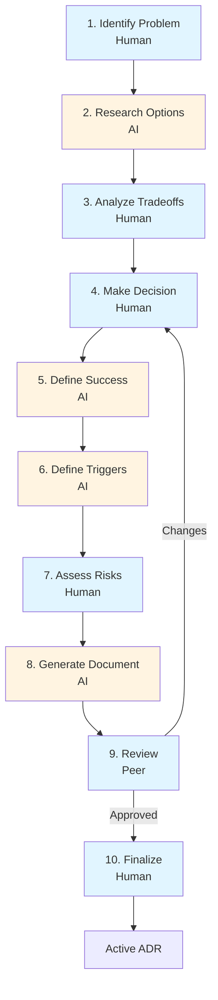

# ADR System - Complete Package

## 📦 What's Included

This package provides a complete system for creating well-structured Architecture Decision Records (ADRs).

### Core Artifacts

1. **[adr.proto](adr.proto)** - Protobuf schema defining ADR structure
2. **[adr_creation_workflow.yaml](adr_creation_workflow.yaml)** - Complete workflow specification
3. **[ADR_WORKFLOW_GUIDE.md](ADR_WORKFLOW_GUIDE.md)** - Quick reference guide
4. **[DECISIONS.md](DECISIONS.md)** - Example: Complete ADR document for this CLI tool project

## 🚀 Quick Start

### For Humans: Creating an ADR

**10-Step Process** (30-60 minutes):

1. **Identify Problem** - One clear sentence
2. **Research Options** - AI finds minimum 3 solutions
3. **Analyze Tradeoffs** - Consider constraints
4. **Make Decision** - Pick option, explain why
5. **Define Success** - What "works" means
6. **Define Triggers** - When to revisit (evidence-based)
7. **Assess Risks** - What could go wrong
8. **Generate Document** - AI creates structured output
9. **Review** - Peer checks quality
10. **Finalize** - Publish as active ADR

### For AI: Workflow Execution

```yaml
Workflow: adr.creation.v1

Roles:
  - ai_assistant: Steps 2, 5, 6, 8 (research, analysis, generation)
  - human_architect: Steps 1, 3, 4, 7, 10 (decisions, risk)
  - reviewer: Step 9 (quality check)

Token Requirements:
  - Network: read (for research)
  - Filesystem: read existing_adrs, write outputs
  - Execution: none
```

## 📋 ADR Structure (Protobuf)

```protobuf
message ADR {
  // Metadata
  string id = 1;
  string title = 2;
  string status = 3;  // draft, active, superseded
  
  // Core content
  ProblemStatement problem = 8;
  repeated Option options = 9;
  Decision decision = 10;
  
  // Lifecycle
  SuccessCriteria success = 11;
  repeated Trigger triggers = 12;
  RiskAssessment risks = 13;
}
```

## 🎯 Key Principles

### Evidence-Based Triggers (NOT Time-Based)

❌ **Wrong**: "Review this decision in 6 months"  
✅ **Right**: "Revisit when build time exceeds 2 minutes"

### Measurable Success Criteria

❌ **Wrong**: "Tool works well"  
✅ **Right**: "Can build any tool in < 30 seconds"

### Minimum 3 Options

Always analyze at least 3 alternatives:
- Option A (typical approach)
- Option B (alternative)
- Option C (hybrid or radical)

Even if one is obvious, documenting why helps future readers.

## 📊 Example ADR Snippet

```markdown
# P1.1. Tool Composition Model

## Problem Statement
How do we structure multiple CLI tools so they work independently 
and as a unified system?

## Options
- **A**: Monolithic binary (simple, inflexible)
- **B**: Separate repos (independent, inconsistent)
- **C**: Workspace + libraries (balanced) ⭐

## Decision
Cargo Workspace + Library Pattern

**Rationale**: Each tool is a library (works standalone) + unified 
CLI imports them. Balance of independence and consistency.

## Success Criteria
✅ Can build any tool independently
✅ Adding tool takes < 30 minutes
✅ Tools share patterns via framework
✅ Zero cross-dependencies between tools

## Metrics
- Build time: < 30s per tool
- Coupling: 0 (framework only)
- Time to add tool: < 30 min

## Triggers to Revisit
- Tool coupling detected (any tool depends on another)
- Adding tool takes > 2 hours
- Workspace build time exceeds 2 minutes
- Users only use standalone OR unified (never both)

## Risks
- Workspace complexity (Low - mitigated by docs)
- Library API maintenance (Medium - use semantic versioning)

## Migration Cost
- To monolithic: Medium (1 week)
- To separate repos: Low (2 days)
- Rollback: Low
```

## 🔄 Workflow Flow



## 📈 Quality Metrics

The workflow enforces:

| Check | Minimum | Why |
|-------|---------|-----|
| Options analyzed | 3 | Avoid tunnel vision |
| Decision rationale | 100 chars | Explain thinking |
| Success criteria | 3-7 items | Make measurable |
| Revisit triggers | 3-5 items | Know when to change |
| Risk assessment | 2+ risks | Be realistic |
| Peer review | Required | Catch blind spots |

## 🎨 Output Formats

### Human-Readable (Markdown)
```
outputs/adr-P1.1.md
├── Problem Statement
├── Options Analysis
├── Decision & Rationale
├── Success Criteria
├── Metrics
├── Triggers
└── Risks & Migration
```

### Machine-Readable (Protobuf)
```
outputs/adr-P1.1.proto
└── Structured data for:
    - Automated monitoring
    - Dashboard integration
    - Trigger detection
    - Metrics tracking
```

## 🔧 Integration Points

### With Code
```rust
// Reference in code
// See ADR-P1.1 for rationale on workspace structure
```

### With CI/CD
```yaml
# Monitor ADR metrics
- name: Check Build Time
  run: |
    if [ $BUILD_TIME -gt 30 ]; then
      echo "⚠️  ADR-P1.1 trigger: build time exceeded"
    fi
```

### With Documentation
```markdown
## Architecture Decisions
See [ADR Index](adrs/README.md) for all decisions.
This approach follows [ADR-P1.1](adrs/adr-P1.1.md).
```

## 📚 Best Practices

### DO ✅
- **Start with "Why"**: Problem statement first
- **Show Your Work**: Document all options, not just winner
- **Make It Measurable**: Numbers and observables
- **Plan for Change**: Migration costs matter
- **Get Review**: Another perspective catches issues

### DON'T ❌
- **Skip Options**: Always analyze alternatives
- **Use Time Triggers**: "Review in Q3" is not evidence-based
- **Forget Risks**: Every decision has downsides
- **Write Once**: ADRs evolve when triggers fire
- **Keep Private**: Share decisions widely

## 🔄 Lifecycle

```
Draft → Review → Active → (Trigger Fires) → Superseded
                    ↓
              (Monitor Metrics)
```

### When Triggers Fire
1. Create new ADR
2. Reference old ADR in "Supersedes" field
3. Document what changed (problem or context)
4. Go through full workflow again
5. Mark old ADR as "superseded"

## 📍 File Organization

```
project/
├── docs/
│   └── adrs/
│       ├── README.md           # Index of all ADRs
│       ├── adr-P1.1.md         # Individual ADRs
│       ├── adr-P1.1.proto
│       ├── adr-P2.1.md
│       └── templates/
│           └── adr-template.md
├── .github/
│   └── workflows/
│       └── adr-metrics.yml     # Monitor triggers
└── Makefile
    └── adr-new:                # Start new ADR
```

## 🎯 Success Indicators

### For the ADR Process
- ✅ ADRs created in < 1 hour
- ✅ 100% of ADRs have triggers defined
- ✅ 100% of ADRs have metrics
- ✅ Peer review happens for all ADRs
- ✅ Triggers actually fire and get acted on

### For Individual ADRs
- ✅ Problem statement fits in one sentence
- ✅ All options have pros/cons
- ✅ Decision rationale is clear
- ✅ Success criteria are testable
- ✅ Migration cost is documented

## 🆘 Troubleshooting

### "Too much work to create ADR"
→ Use the workflow! AI does research, analysis, generation.  
→ Human only makes decisions and reviews.  
→ Should take 30-60 minutes, not days.

### "Triggers never fire"
→ Make them more observable/measurable.  
→ Integrate into monitoring/CI.  
→ Review metrics quarterly.

### "ADRs go stale"
→ That's expected! When triggers fire, supersede them.  
→ Stale ADR = triggers weren't hit = decision still working.

### "Too formal for small decisions"
→ Use lightweight version for tactical decisions.  
→ Full process for strategic/architectural only.  
→ 5-minute decisions don't need ADRs.

## 🎓 Learning Resources

### Examples
- **[DECISIONS.md](DECISIONS.md)**: Complete example for CLI tool project
- Shows all sections with real content
- Demonstrates evidence-based triggers
- Includes metrics dashboard

### Templates
- Use workflow to generate consistent structure
- Protobuf schema ensures completeness
- Peer review catches missing sections

## 📞 Support

### Questions?
1. Check [ADR_WORKFLOW_GUIDE.md](ADR_WORKFLOW_GUIDE.md) for quick reference
2. Review [DECISIONS.md](DECISIONS.md) for complete example
3. Use workflow to ensure nothing is missed

### Contributing
- Improve workflow based on experience
- Add new checks in acceptance criteria
- Extend protobuf schema for new fields
- Share ADR templates

---

## 🎉 You're Ready!

You now have everything you need to create structured, maintainable, evidence-based Architecture Decision Records.

**Next Steps**:
1. Read [ADR_WORKFLOW_GUIDE.md](ADR_WORKFLOW_GUIDE.md)
2. Review [DECISIONS.md](DECISIONS.md) as example
3. Start your first ADR using the workflow
4. Monitor metrics and watch for triggers

Remember: **Good decisions deserve good documentation!**
